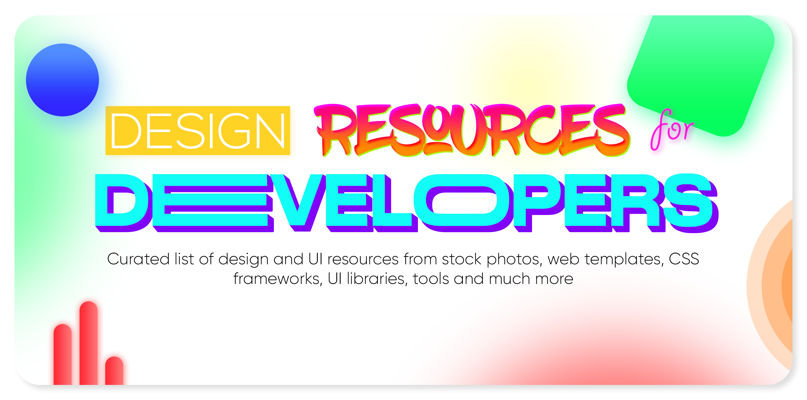

## Table of Contents

- [UI Graphics](#ui-graphics)
- [Fonts](#fonts)
- [Colors](#colors)
- [Icons](#icons)
- [Logos](#logos)
- [Favicons](#favicons)
- [Icon Fonts](#icon-fonts)
- [Stock Photos](#stock-photos)
- [Stock Videos](#stock-videos)
- [Stock Music & Sound Effects](#stock-music--sound-effects)
- [Vectors & Clipart](#vectors--clip-art)
- [Product & Image Mockups](#product--image-mockups)
- [HTML & CSS Templates](#html--css-templates)
- [CSS Frameworks](#css-frameworks)
- [CSS Methodologies](#css-methodologies)
- [CSS Animations](#css-animations)
- [Javascript Animations](#javascript-animation-libraries)
- [UI Components & Kits](#ui-components--kits)
- [React UI Libraries](#react-ui)
- [Vue UI Libraries](#vue-ui)
- [Angular UI Libraries](#angular-ui)
- [Svelte UI Libraries](#svelte-ui)
- [Design Systems & Style Guides](#design-systems--style-guides)
- [Online Design Tools](#online-design-tools)
- [Downloadable Design Software](#downloadable-design-software)
- [Design Inspiration](#design-inspiration)
- [Image Compression](#image-compression)
- [Chrome Extensions](#chrome-extensions)
- [Others](#others)

[从库存照片，Web模板，CSS框架，UI库，工具等中精选出的设计和UI资源清单网站看这里](https://github.com/bradtraversy/design-resources-for-developers)